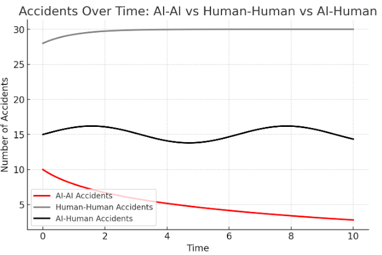

# Header

**Title:** Self-Driving Cars in Conversation: The AI Systems on Our Roads

**Group members:** 

* Mikail KARIMI-SHAHIDI \- Leader/Facilitator  
* Harib SHAHBAZ \- Checker/Editor  
* Matthew BODENSTEIN \-  Arbitrator/Monitor

**GitHub Repo:**

* [https://github.com/MatthewBoden/EECS-4461-Team-10-Project](https://github.com/MatthewBoden/EECS-4461-Team-10-Project)

# Section 1

Our chosen phenomenon revolves around self-driving vehicles that utilize Artificial Intelligence and their interactions with other vehicles. These other vehicles can be self-driving (AI-to-AI) or human-operated (AI-to-Human, Human-to-AI). When considering the AI-to-AI example, these social bots communicate with each other using Dedicated Short Range Communication (DSCR) when in range. This enables them to send data about road conditions, their surroundings, and different analytics, which can be passed through a large chain of self-driving cars that are in range. This can lead to emergent behaviour between these social bots and their interactions. AI-to-AI dynamics is extremely important to explore for the future as the access to these social bots grows and their reliability and influence expand 

In terms of key dynamics and their relevance to course material, there are a multitude of examples. Firstly, there is an ever-evolving co-construction going on between technological determinism and social determinism. Artificial Intelligence-powered vehicles have to abide by the many laws that pertain to vehicles, such as speeding limits, traffic lights, etc. Society influences the technological advancements in this sector, as it can influence the extent of their autonomy through conceived notions and beliefs. These are just a few examples of the interplay between technological advancements and societal impacts. 

Secondly, we can explain this phenomenon with the metaphor of the trophic structure. The primary producers are the autonomous car manufacturers; the ones who are creating the vehicles that allow for the sending of signals to other vehicles. The primary consumers are the individuals who purchase and use these vehicles. The secondary consumers are the people who review or critique the vehicles. The tertiary consumers are the ones who perform analysis of the impacts of these vehicles (traffic metrics, collisions, etc…). Lastly, the quaternary consumers are the organizations and governments that form legislation around these vehicles: what is and what isn't allowed. We will be exploring parts of this media ecosystem in our simulation.

Finally, although there are many other examples, affordance theory can be used to examine the action possibilities taken by these autonomous AI agents and how they evolve in our normative vehicle systems. The potential for AI to make decisions is truly limitless, and thus should be seen from the viewpoint of affordance theory to understand it better. 

# Section 2

1. **Xu, Q., Wang, B., Zhang, F., Regani, D. S., Wang, F., & Liu, K. J. R. (2020). Wireless AI in Smart Car: How Smart a Car Can Be? *IEEE Access*, *8*, 1–1. [https://doi.org/10.1109/ACCESS.2020.2978531](https://doi.org/10.1109/ACCESS.2020.2978531)** 

Xu et al. (2020) discuss the relationship between smart cars, the integration of wireless AI, and various aspects of improvements by AI. The article discusses AI in wireless network technology, which enables real-time decision-making, ultimately enhancing autonomous driving, road user safety, and efficiency. It also mentions how AI could be trained using many techniques, such as deep learning and reinforcement learning. These methods can all help ensure the smart car adapts to changing environments. It is mentioned that edge computing also ensures shortened response times, minimizing the distance over which data must travel before processing. "V2X" communication is also mentioned, which allows communication and data exchange between the cars. Safety and privacy considerations in AI-enabled smart vehicles are also mentioned, as well as recommended solutions such as encrypted data sharing and decentralized AI. The article concludes with the notion that AI models need a lot of training to learn to deal with unpredictable scenarios.

**Note:** We replaced *Maxmen, A. (2018), A Moral Map for AI cars* with the paper below since we found it to be more directly relevant to our dynamic of interest

2. **Ali, A., Jiang, L., Patil, S., Li, J., & Heath, R. W. (2018, August). Vehicle-to-vehicle communication for autonomous vehicles: Safety and maneuver planning. In 2018 IEEE 88th Vehicular Technology Conference (VTC-Fall) (pp. 1-5). IEEE. [https://ieeexplore.ieee.org/document/8690946](https://ieeexplore.ieee.org/document/8690946)**

Ali et al. (2019) explore AI-driven autonomous vehicles (AVs) and how they can enhance road safety and manoeuvre efficiency through vehicle-to-vehicle (V2V) communication. Through simulations and compiling real-world data, they were able to find that V2V communication reduces collision probability from 7.4% to 1.6%, improves lane-change efficiency by 40%, and cuts manoeuvre time from 3.1s to 1.8s. Furthermore, they were able to conclude that V2V AI coordination between these vehicles aided in enhancing the perceptual range by 35% by enabling the detection of hidden objects beyond what a normal human or AV would see. Additionally, another interesting finding by this paper was that braking uncertainty dropped by 20-30%, leading to overall smoother stops. In addition, overall traffic throughput increased by 25% which led to reduced traffic congestion. These results concluded that AI-powered V2V significantly outperformed AI-powered vehicles without V2V communication due to its ability to share real-time information between vehicles. This overall leads to faster, smarter, broader, and safer decision-making abilities by vehicles. 

**Note:** The paper below was not mentioned in our first deliverable. We think that this paper is a good addition to illustrate another perspective of our phenomenon even though we have already included 2 summaries. 

3. **Wang, T. H., Manivasagam, S., Liang, M., Yang, B., Zeng, W., & Urtasun, R. (2020). V2vnet: Vehicle-to-vehicle communication for joint perception and prediction. In Computer Vision–ECCV 2020: 16th European Conference, Glasgow, UK, August 23–28, 2020, Proceedings, Part II 16 (pp. 605-621). Springer International Publishing. [https://arxiv.org/abs/2008.07519](https://arxiv.org/abs/2008.07519)** 

In this study, Wang et al. (2020) conducted a comparative analysis of how the sole addition of vehicle-to-vehicle (V2V) communication enhanced their self-driving vehicle simulation exponentially by enabling enhanced vehicle perception and motion forecasting. Essentially, their study highlighted how transmitting data using V2V can lead to the creation of deep neural networks with real-time 3D rendering. These models, enabled through V2V communication, demonstrated considerable improvements in perceptual vision. Overall, their study illustrates how V2V communication is an integral component in self-driving cars as it can improve object detection, motion forecasting, and traffic safety, leading to an overall lower collision rate when compared to traditional self-driving models that do not incorporate V2V communication.

**Interpretation:**

These studies outline the implementation of our phenomenon in the real world. These results indicate positive consequences that we will keep in mind when iterating on our prototype. We will keep in mind the valence, utility, moral/ethical value, and anticipation of these consequences when looking at emergent behaviour in our simulations.

# Section 3

The mesa examples that best describe our phenomenon of interest are the **Boid Flocking** and **Epstein Civil Violence** models.

## 3.1

In our media ecosystem, the social bots present are AI self-driving vehicles. Social bots are automated software programs designed to perform tasks within media ecosystems. This is exactly what our AI self-driving vehicles are, software programs that replicate human behaviour in the form of driving. The role of these social bots, rifling from the media ecosystem metaphor, are part of the primary producer. They are the vehicle systems that participate in the flow of information and form the base of our trophic structure. To outline their behaviours/goals and further illustrate their roles, we will use a goal hierarchy:

* Their **low-level actions** are their movement affordances and communication capabilities (outlined in Section 3.2). These are any atomic capabilities that we program into our simulation for these agents that can occur at a single step in Mesa. These low-level actions are similar to the possible low-level actions agents can take in the Epstein Civil Violence model.  
* Their **intermediate behaviour** is the decision-making that takes place to avoid other vehicles. These are more complex computations that will also be computed at every step in our function, similar to the Mesa examples as well as the algorithms discussed in Section 3.3.  
* And finally, their **high-level goal** is to get from point A to point B while avoiding collisions. This correlates it back to the big picture of these AI vehicles in our media ecosystem.

The other entity involved will be human-operated vehicles. These are a direct copy of what a human would look like on the road driving a non-AI vehicle. If we expand our ecosystem outlined in Section 1 to include abiotic (non-AI) elements, we can include these human-operated vehicles as primary producers as well. They act as the complement of the AI vehicles. Furthermore, to outline their behaviours/goals and further illustrate their roles, we will use a goal hierarchy:

* Their **low-level actions** are the same as the AI agents, except for the fact that these human-operated do not have the same communication capabilities.  
* Their **intermediate behaviour** is the decision-making that takes place to avoid other vehicles. These differ in the parameters provided, since human-operated vehicles will have to use human perception.  
* And finally, their **high-level goal** is to get from point A to point B while avoiding collisions. 

The reason why human agents differ in perception relative to AI agents is to mimic the reality that humans can't always be cognizant of every vehicle around them at all times. This will illustrate the effects of our phenomenon of interest, since V2V in real life provides AI vehicles with more perception than a non-AI vehicle would. 

All in all, these entities are similar to the Epstein Civil Violence model and Boid Flocking model, as these models demonstrate the movement of entities in a simulated environment. We will use similar programmatic capabilities that are found in these examples to simulate the roles, behaviours, and goals outlined above. We are particularly interested in the dynamics and emergent behaviour that arise from these interactions, similar to the ones occurring in the example models.

## 3.2

The shared affordances that the entities above possess are that each vehicle can change lanes, move forward, slow down, and collide. These affordances allow us to simulate a highway environment, since these are typical affordances that vehicles on the road have. Changing lanes in particular introduces more complexity, as this allows for non-linearity in our entities movements.

One key difference in affordances is that AI agents can utilize the aforementioned V2V signalling, while human agents cannot. As a result, the affordances of Human agents are limited relative to the AI agents due to their difference in signals, resulting in variance in perception. The primary interaction/affordance that we will be comparing is the collision that can occur between vehicles. These are discussed in further detail in Section 4\.

Comparing the movement of agents in the Epstein Civil Violence model, the grid structure affords paths through which each vehicle can move through its surroundings. The affordances from the Boid Flocking algorithm will be similar to our simulation, since our AI vehicles will utilize the reception of signals from other vehicles by communicating and coordinating their movement.

## 3.3

The Boid Flocking model algorithm simulates agents interacting with three major components: alignment, cohesion, and separation to form their algorithm. Our AI vehicle movement algorithm follows a similar interaction mechanism where it relies on proximity, influence, and group dynamics to make decisions. The parameters of this algorithm are heavily based around the aforementioned V2V signals. In contrast, the human vehicle movement algorithm will be simpler and not utilize the inputs provided by V2V. It is important to note that the Boid model is simulated in a continuous space, whereas our AI agents will use a grid spatial system similar to the Epstein model.

Additionally, the Epstein Civil Violence Model captures how agents decide to follow or break rules based on their environment, similar to AI-to-AI car interactions, and this would be classified as a rule-based decision-making algorithm. Just as agents evaluate conditions before acting, AI vehicles interacting with one another evaluate traffic, nearby vehicles, and road conditions to decide whether to follow rules or adapt around them.

# Section 4

When viewing our simulation, users would see a bird's eye view of a road system that includes AI vehicles and human vehicles, all interacting with each other. Vehicles will be spawned at the "bottom" of the highway (Point A) and work their way "upwards" (Point B), this spawning will occur *dynamically* throughout the simulation at every step. Their goal is to make it to the end of the highway system. Our phenomenon is displayed by the media component of how these AI vehicles will interact with one another. AI vehicles have signals between one another that allow them to have a perception of one another to prevent collisions when lane changes occur. Human-operated vehicles don't have the same signals. 

We will monitor collision rates between humans and other humans, humans with AI vehicles, and AI vehicles with AI vehicles to observe our phenomenon. We will include a data visualization, as shown below, to plot this data as a function of time with 3 distinct lines to denote each type of interaction. We expect collision rates to reasonably mimic the research we performed in the studies outlined in Section 2\. Furthermore, we will look for movement patterns that may emerge from these interactions and document these findings. 

We will adjust the parameters of this complex system iteratively. We can include simulations that have different splits of AI and Human vehicles. Some examples of this can be 50% AI/50% Human agents, 75% AI/25% Human agents, and 100% AI/0% Human (futuristic simulation). We can also modify the communication range AI vehicles have to communicate with one another. This will allow us to explore different versions of V2V implementations. Finally, we can modify the columns of the grid to have different speeds. This would allow our simulation to be more representative of traffic flow in real-life streets, since speed increases from the rightmost lane to the leftmost lane.

