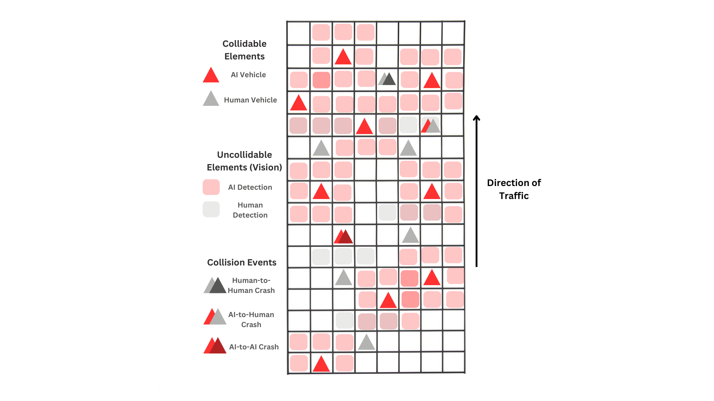

# Header

**Title:** Self-Driving Cars in Conversation: The AI Systems on Our Roads

**Group members:** 

* Mikail KARIMI-SHAHIDI  
* Harib SHAHBAZ  
* Matthew BODENSTEIN

**GitHub Repo:**

* [https://github.com/MatthewBoden/EECS-4461-Team-10-Project](https://github.com/MatthewBoden/EECS-4461-Team-10-Project)

# Section 1

Our chosen phenomenon revolves around self-driving vehicles that utilize Artificial Intelligence and their interactions with other vehicles. These other vehicles can be self-driving (AI-to-AI) or human-operated (AI-to-Human, Human-to-AI). When considering the AI-to-AI example, these social bots communicate with each other using Dedicated Short Range Communication (DSCR) when in range. This enables them to send data about road conditions, their surroundings, and different analytics, which can be passed through a large chain of self-driving cars that are in range. This can lead to emergent behaviour between these social bots and their interactions. AI-to-AI dynamics is extremely important to explore for the future as the access to these social bots grows and their reliability and influence expand 

In terms of key dynamics and its relevance to course material, there are a multitude of examples. Firstly, there is an ever-evolving co-construction going on between technological determinism and social determinism. Artificial Intelligence-powered vehicles have to abide by the many laws that pertain to vehicles, such as speeding limits, traffic lights, etc. Society influences the technological advancements in this sector, as it can influence the extent of their autonomy through conceived notions and beliefs. These are just a few examples of the interplay between technological advancements and societal impacts. 

Secondly, we can explain this phenomenon with the metaphor of the trophic structure. The primary producers are the autonomous car manufacturers; the ones who are creating the vehicles that allow for the sending of signals to other vehicles. The primary consumers are the individuals who purchase and use these vehicles. The secondary consumers are the people who review or critique the vehicles. The tertiary consumers are the ones who perform analysis of the impacts of these vehicles (traffic metrics, collisions, etc…). Lastly, the quaternary consumers are the organizations and governments that form legislation around these vehicles: what is and what isn't allowed. We will be exploring parts of this media ecosystem in our simulation.

Finally, although there are many other examples, affordance theory can be used to examine the action possibilities taken by these autonomous AI agents and how they evolve in our normative vehicle systems. The potential for AI to make decisions is truly limitless, and thus should be seen from the viewpoint of affordance theory to better understand it. 

# Section 2

* **Xu, Q., Wang, B., Zhang, F., Regani, D. S., Wang, F., & Liu, K. J. R. (2020). Wireless AI in Smart Car: How Smart a Car Can Be? *IEEE Access*, *8*, 1–1. [https://doi.org/10.1109/ACCESS.2020.2978531](https://doi.org/10.1109/ACCESS.2020.2978531)** 

Xu et al. (2020) discuss the relationship between smart cars, the integration of wireless AI, and various aspects of improvements by AI. The article discusses AI in wireless network technology, which enables real-time decision-making, ultimately enhancing autonomous driving, road user safety, and efficiency. It also mentions how AI could be trained using many techniques, such as deep learning and reinforcement learning. These methods can all help ensure the smart car adapts to changing environments. It is mentioned that edge computing also ensures shortened response times, minimizing the distance over which data must travel before processing. "V2X" communication is also mentioned, which allows communication and data exchange between the cars. Safety and privacy considerations in AI-enabled smart vehicles are also mentioned, as well as recommended solutions such as encrypted data sharing and decentralized AI. The article concludes with the notion that AI models need a lot of training to learn to deal with unpredictable scenarios.

**Note:** We replaced Maxmen, A. (2018), A Moral Map for AI cars with the paper below since we found it to be more directly relevant to our dynamic of interest

* **Ali, A., Jiang, L., Patil, S., Li, J., & Heath, R. W. Jr. (2019). *Vehicle-to-vehicle communication for autonomous vehicles: Safety and maneuver planning.* IEEE. [https://ieeexplore.ieee.org/document/8690946](https://ieeexplore.ieee.org/document/8690946)**

Ali et al. (2019) explore AI-driven autonomous vehicles (AVs) and how they can enhance road safety and manoeuvre efficiency through vehicle-to-vehicle (V2V) communication. Through simulations and compiling real-world data, they were able to find that V2V communication reduces collision probability from 7.4% to 1.6%, improves lane-change efficiency by 40%, and cuts manoeuvre time from 3.1s to 1.8s. Furthermore, they were able to conclude that V2V AI coordination between these vehicles aided in enhancing the perceptual range by 35% by enabling the detection of hidden objects beyond what a normal human or AV would see. Additionally, another interesting finding by this paper was that braking uncertainty dropped by 20-30%, leading to overall smoother stops. In addition, overall traffic throughput increased by 25% which led to reduced traffic congestion. These results concluded that AI-powered V2V significantly outperformed AI-powered vehicles without V2V communication due to its ability to share real-time information between vehicles. This overall leads to faster, smarter, broader, and safer decision-making abilities by vehicles. 

# Section 3

The mesa examples that best describe our phenomena of interest are the **Boid Flocking** and **Epstein Civil Violence** models.

## 3.1

In our media ecosystem, the social bots present are AI self-driving vehicles. The roles of these social bots are to get from point A to point B while avoiding collisions. Their goals are to avoid collisions and drive safely to the other end of the highway. Their behaviours include moving forward, changing lanes, changing speed, and detecting other vehicles all around them through signals (V2V communication, phenomena of interest).

The other entity involved will be human-operated vehicles. Their roles and goals will mimic the ones used to describe the social bots. In terms of their behaviour, human-operated cars will also include moving forward, changing lanes, and changing speeds, but they will have limited detection of other vehicles around them compared to AI vehicles. This is to mimic the fact that humans can't always be cognizant of every vehicle around them at all times, like software can in this media ecosystem.

This is similar to the Epstein Civil Violence model and Boid Flocking model, as these models demonstrate the movement of entities in a simulated environment. We are particularly interested in the dynamics and emergent behaviour that arise from these interactions, similar to the ones occurring in the example models.

## 3.2

There are many advantages to AI-to-AI car interactions on a highway. As aforementioned, each car can change lanes, move forward, and slow down. The affordances of Human agents are limited relative to the AI agents due to their difference in signals, resulting in variance in perception. Comparing the movement of agents in the Epstein Civil Violence model, the grid structure affords paths through which each car can scan its surroundings. The affordances from the Boid Flocking algorithm will be similar to our simulation since our AI cars will be safe from every other vehicle by communicating and coordinating their movement much like the flock does.

## 3.3

The Boid Flocking model algorithm simulates agents interacting with three major components: alignment, cohesion, and separation to form their algorithm. Our AI-to-AI car movement algorithm follows a similar interaction mechanism where it relies on proximity, influence, and group dynamics to make decisions. It is important to note that the Boid model is simulated in a continuous space, whereas our AI agents will use a grid spatial system similar to the Epstein model.

Additionally, the Epstein Civil Violence Model captures how agents decide to follow or break rules based on their environment, similar to AI-to-AI car interactions, and this would be classified as a rule-based decision-making algorithm. Just as agents evaluate conditions before acting, AI cars interacting with one another evaluate traffic, nearby vehicles, and road conditions to decide whether to follow rules or adapt around them.

# Section 4

When viewing our simulation, users would see a bird's eye view of a road system that includes AI vehicles and human vehicles, all interacting with each other. Cars will be spawned in at the "bottom" of the highway and work their way "upwards", this spawning will occur throughout the simulation at every step. Their goal is to make it to the end of the highway system. Our phenomena is displayed by the media component of how these AI cars will interact with one another. AI vehicles have signals between one another that allow them to have vision of one another to prevent collisions. Human-operated vehicles don't have the same signals. We will monitor collision rates between humans and other humans, humans with AI cars, and AI cars with AI cars to observe our phenomena. We will include a visualization, as shown below, to plot this data. Furthermore, we can also look at movement patterns that emerge from these interactions that arise from our phenomena and document these findings. 

